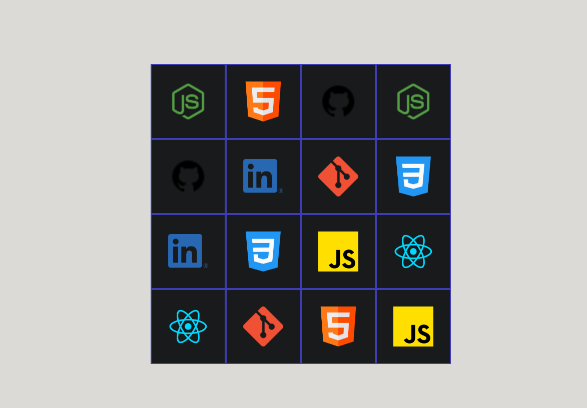

 <h1>Memory Game</h1>
 
Memory Game is a game that works the player's memory by challenging them to display their memory skills.

   
 <h2>Why a memory game?</h2>
 
I chose this project because I wanted to improve my skills with arrays and put to work some of the basics, like map and sort functions.

 <h2>What i learn</h2>
 
With this project, I learned how to use useEffect and how to use map to create elements and add values dynamically. There are some minor things, like using CurrentTarget, but overall, I improved my problem-solving skills.

<h3>Technologies</h3>
<ul>
<li>HTML</li>
<li>CSS</li>
<li>React js</li>
</ul>

<a target="_blank" href="https://icons8.com/icon/97624/brain">Brain</a> icon by <a target="_blank" href="https://icons8.com">Icons8</a>